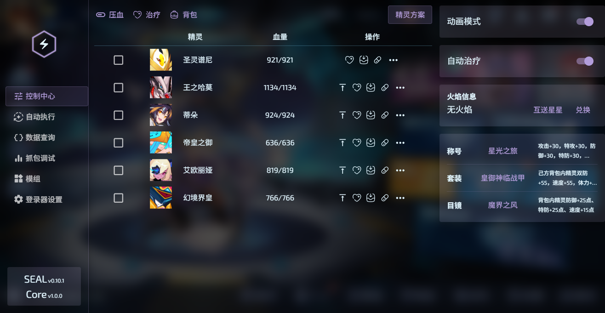
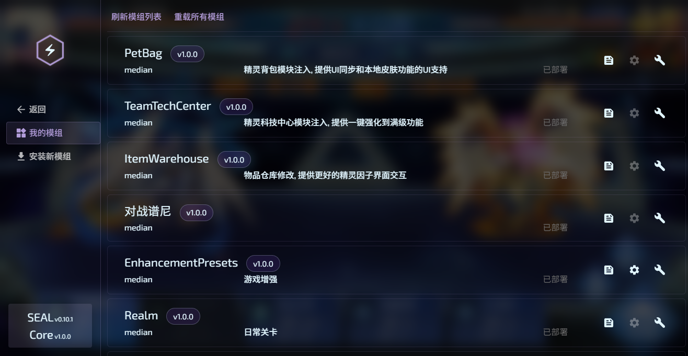
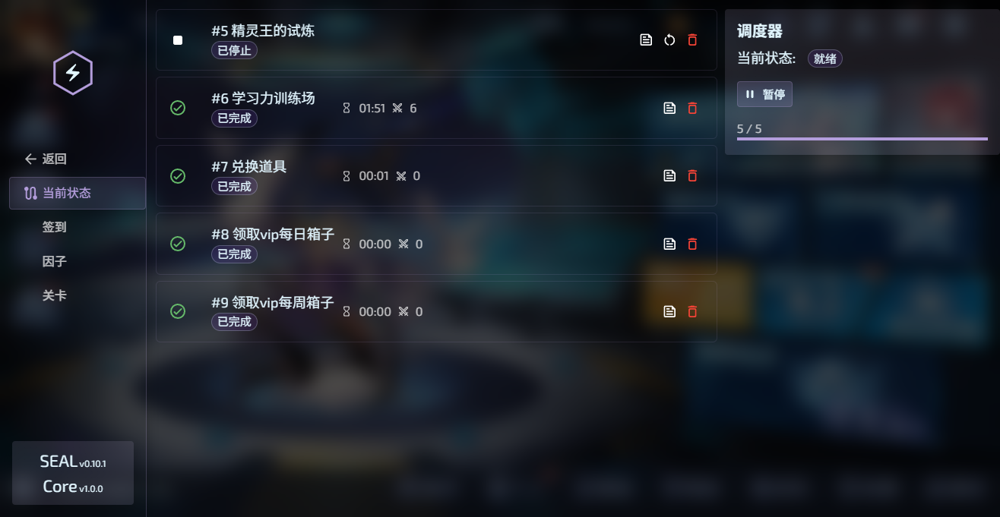
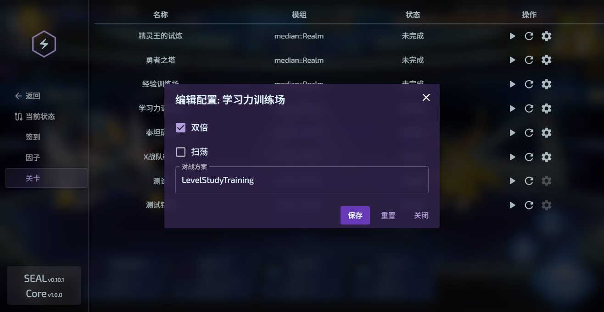
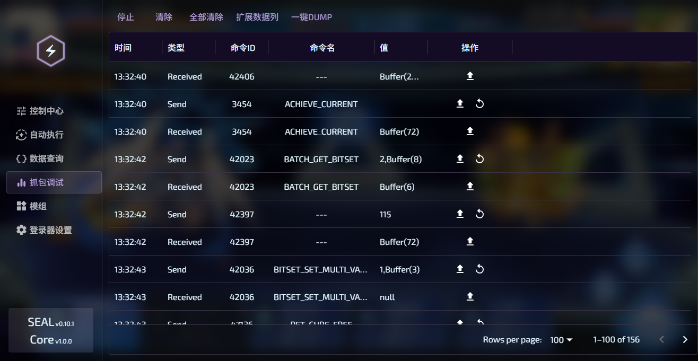

# SEA Project

<p align="center">
    <a href="https://median-dxz.github.io/sea-project-website/">
        
    </a>
</p>
<p align="center">
    赛尔号 H5 端登陆器 && API 封装接口 && 模组框架
</p>
<p align="center">


</p>

目前处于**alpha**阶段，整体架构和api随时可能有**大型更改和重构**。

如果需要使用当前阶段的内容，请加入我们的DC群组，以跟踪项目进展和获得帮助。

[](https://discord.gg/Q7AJsEzSdN)

## 置顶声明

**IMPORTANT：项目全部开源，仅供学习使用，禁止用于任何商业和非法行为。项目内全部功能不涉及付费相关和 pvp 相关，项目内全部通信仅涉及淘米官方服务器，不涉及任何第三方。**

**WARNING: 目前该项目的安全性考虑是欠缺的，请注意：模组是不可信且不受控的外部代码，将在前端执行，这可能导致严重的安全问题！请勿安装任何未经事先人工验证的模组！**

项目正在重构迁移Unity版本，请加入我们的DC群组获取更多信息。H5版本已成为弃子，本项目将进入归档倒计时。

SEAL-H5（SEA登录器H5端）目前支持**解锁H5 UI**，作为H5端失去维护的缓解措施，并且登录器内置的因子对战功能仍然**支持新版U端因子**。

参阅 [#39](https://github.com/median-dxz/seerh5-assistant/issues/39)

## 简介

**SeerH5-Assistant** 是一款使用typescript编写的赛尔号H5端登陆器。项目目前包含四个部分：core、launcher、server、sdk，其中

- `core`: 核心库，负责环境注入和接口封装
- `launcher`: 目前的登录器应用程序原型，同时负责e2e测试
- `server`: 登陆器后端，负责登陆器服务，游戏资源反代以及用户配置的存储（参见~~现在还不存在的~~文档了解为什么使用后端服务而不是直接使用Electron来实现这些）
- `sdk`: 适用于本登录器的模组开发框架

项目简称: SEA，登录器简称：SEAL

**官方文档站**：[SEA Project](https://median-dxz.github.io/sea-project-website/)

## 截图












## 快速入门

前排提示：本项目目前处于alpha阶段，如果你对相关的技术栈不熟悉，可以等待该项目成熟后再来。

### 运行环境要求

请确保node的版本符合要求：

- node >= 20.11.0

此外，如果使用默认的pnpm进行包管理，还需要满足：

- pnpm >= 10.0.0

### 搭建基本运行环境

首先clone整个仓库，然后安装依赖：

```shell
pnpm i
```

依赖安装完成后，项目目前结构如下：

- `packages/core`: 核心库
- `packages/launcher`: 登录器前端
- `packages/server`: 登录器后端
- `packages/mod-type`: 模组类型定义
- `packages/mod-resolver`: 模组通用处理逻辑
- `sdk`: sdk环境，内含一些预制的模组包

### 构建工作区

接下来需要构建工作区。在项目根目录下运行：

```shell
pnpm build:workspace
```

该命令会自动构建整个项目的必要部分，并安装到`sdk`下。

同时，因为`launcher`是使用工作区链接来安装`@sea/core`的，因此现在登录器就能使用了。

### 在开发模式下运行登录器

在开发模式下，登录器的前端和后端需要**分别**运行。

首先在`@sea/server`包下启动后端:

```shell
pnpm start
```

后端会默认在本地`2147`端口上运行。

然后在`package/launcher`下创建`.env.local`文件，详情见vite的环境变量配置文档：

```ini
VITE_BACKEND_PORT={你的后端端口号，默认是2147}
```

最后在`@sea/launcher`包下启动前端开发服务器：

```shell
pnpm dev
```

### 获得生产构建

如果想要获得登录器的生产构建，那么直接在项目根目录下运行构建脚本：

```shell
pnpm build:executable
```

该命令会启用一个构建脚本，构建登录器前端和后端，并使用`pkg`打包为`Windows`下可以独立运行的服务器程序。如果你有能力，可以修改配置以生成`MacOS`或`Linux`端

构建的详细步骤请参考`scripts/build-executable.js`，最后一步是使用pkg生成可执行文件。在`packages/server/bin`下得到`server.exe`，直接运行即可。

pkg打包是一个临时方案，未来将使用deno生成SAE（standalone executables，单体可执行文件），使用Tauri | Electron分发生产版本。

### 使用模组

sdk中预置了常用的模组，提供了一系列强大的功能扩展。

在项目根目录下运行`pnpm build:workspace`后，该命令会启用一个脚本来构建`@sea/mod-type`、`@sea/mod-resolver`和`@sea/core`，并自动安装到sdk下。

sdk中包含一个vite构建插件，该插件会在构建是自动安装模组到登录器后端，安装是通过启动后端服务上用于安装模组的REST端点进行的，因此构建模组之前需要**先运行后端**。

接着配置构建插件使用的后端URL环境变量，在`sdk`下创建`.env`文件：

```ini
VITE_SEA_SERVER_URL={后端URL}
```

如果上面步骤都使用默认配置的话，这里的URL应该是`http://localhost:2147`。

然后在`sdk`下运行：

```shell
npm i
npm build
```

---

最后进入游戏！请注意浏览器版本, 如果不支持import-map, 原生esm加载等功能, 需要手动添加相应的polyfill。

注意该项目的后端的主要功能是作为**本地数据存储**和**跨域反代**，**部署在本地**。

关于登录器如何使用，模组编写等问题，请前往文档站查看（待更新）。

## SDK的环境构成

1. typescript+vite脚手架的基本配置
2. `@sea/core`库的接口定义, 以及将其视为外部模块所需的相关配置
3. `@sea/mod-type`库提供了模组接口定义文件，还提供了扩展的`@sea/core`定义（需要登录器支持）
4. `@sea/core`库内嵌的`egret`白鹭引擎定义，以及`seerh5`提供的游戏接口定义
5. vite构建插件，用以从sdk快速安装模组到登录器

## 功能点

core：

- 自动战斗
  - 设置战斗模型
  - 完备的回合信息
- 统一的游戏静态数据查询接口
- 常用操作封装
- 精灵养成操作封装
  - 包含一个内部精灵信息缓存
- 收发包支持
- 多个事件订阅器
  - 模块加载
  - 收发包
  - 各种事件的监听
  - 注入了额外的常用事件的hook
- 游戏内实体封装
- 支持扩展

launcher：

- 扩展核心
  - 实现一些常用功能集
    - 压血
    - 战队派遣
    - 切换背包
  - 游戏内部优化
    - 本地换肤
    - 静态模式对战加速
    - 查看对方血量
    - 战队加成一键加满
    - h5端自动治疗开关
    - 离屏挂机
    - 更多功能编写中...
- 控制面板，你可以在这里轻松：
  - 切换称号
  - 切换套装
  - 分开治疗指定精灵
  - 压血
  - 借火
  - 保存并切换背包
- 一键签到
- 一键日任，稳定不掉线
- 精灵因子面板
  - 扫荡
  - 自定义因子PVE脚本
  - 手动对战
- 收发包调试
- 快捷控制面板
- 充分的扩展接口
  - 模组安装与管理
  - 自定义关卡，自定义精灵配置，自定义出招脚本

其他：

- 入口注入
- 多重缓存加速游戏加载
- 登陆器和实际游戏客户端之间的ui与数据同步
- 反代资源
- ui操控

## 更多信息

(待更新)

## 开源协议

**MPL-2.0**

并确保您遵守了 **eula** 中的开发者条款
